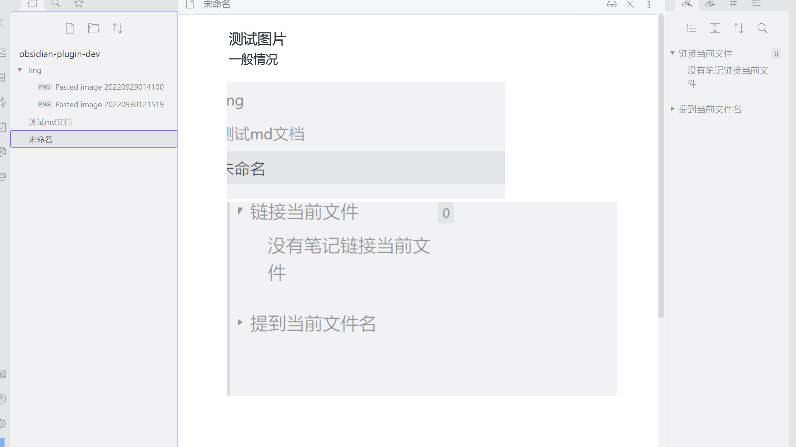
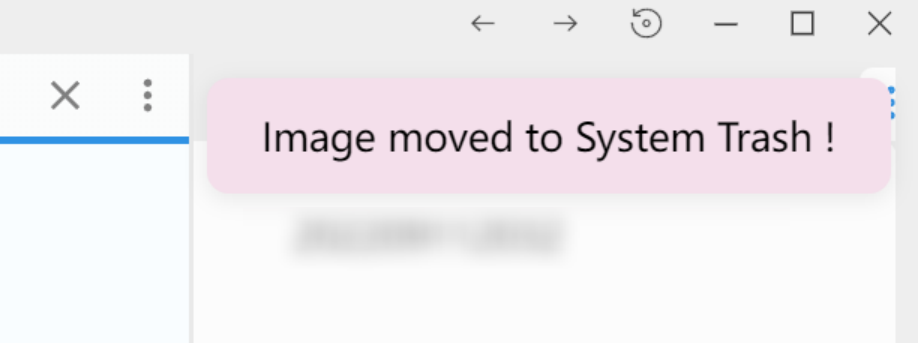
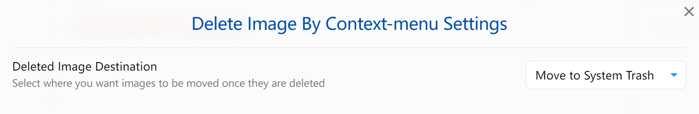

# nn-delete-image-in-use

> [中文版](ZH.md)

## Installation

You can install the plugin via the Community Plugins tab within the Obsidian app.
[Here](https://obsidian.md/plugins?id=open-vscode)'s the plugin in Obsidian's Community Plugins website.
You can install the plugin manually by copying a release to your `.obsidian/plugins/nn-delete-image-in-use` folder.

## Usage

**Intro**: When you right-click on an image with your mouse, you can tap the context menu item to easily delete the image file and remove the link in use from a Markdown document.

1. Activate the plugin from Community Plugins
2. Move your mouse over the image you need to delete(move to trash)
3. Right click, and tab the context menu item "Image moved to \*\*\*". you will see the message in the corner of the top-right of the obsidian window.

**Scanned Image Formats** : jpg, jpeg, png, gif, svg, bmp

> Note: This plugin is inspired by both The Plugin [Copy Image and URL context menu](https://github.com/NomarCub/obsidian-copy-url-in-preview) and [Obsidian Plugin for Clearing Unused Images](https://github.com/ozntel/oz-clear-unused-images-obsidian#support), and the operation to delete an image by context menu has the same mode which may cause a conflict. So you need to disable the plugin Copy Image and URL... If you require to copy the image, then you can use Plugin Image Toolkit.

### Settings-Deleted Image Destination

Please make sure that you select the destination for the deleted images under "Delete Image By Context-menu Settings" tab. You have 3 options:

1. **Move to Obsidian Trash** - Files are going to be moved to the `.trash` under the Obsidian Vault.
2. **Move to System Trash** - Files are going to be moved to the Operating System trash.
3. **Permanently Delete** - Files are going to be destroyed permanently. You won't beable to revert back.

## Development

This plugin follows the structure of the [Obsidian Sample Plugin](https://github.com/obsidianmd/obsidian-sample-plugin), see further details there.
Contributions are welcome.

## Support

If you are enjoying the plugin then you can support my work and enthusiasm by buying me a coffee: 
