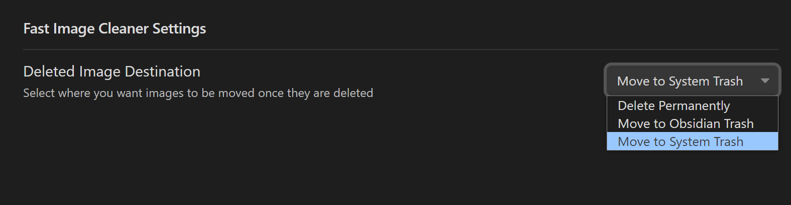

# Fast Image Cleaner

[中文](./ZH.md) / EN

This plugin allows you to quickly remove image attachment and referenced link from your document. You can quickly delete image(or file,media) attachment and their reference link with right-click menu.

## Demo

https://user-images.githubusercontent.com/55736512/218007296-eba24cf9-b3bd-40b5-a1b6-32efee1fd396.mp4

## Features

1. Remove image attachment file and its referencing link
2. When the same image is referenced twice or more, a popup window will appear and it will not be deleted directly to avoid the image being deleted by mistake. pop-up window with the current reference to the image of the document and other documents referencing the image of the document path information, the bottom `close` button and `remove link` button, click `remove link` button can continue to remove **current document** in the image reference link.
    - ~~Case 1: the same document is referenced multiple times in a single document~~
    - Case 2: the same image is referenced in multiple documents at the same time
3. Support markdown and wiki link style links
4. Support for three different formats of **Internal link types** ([details](https://help.obsidian.md/Linking+notes+and+files/Internal+links))
    - The shortest possible form
    - Relative path based on the current notes
    - Absolute path based on the repository root directory
5. Supported image types: `jpg, jpeg, png, gif, svg, bmp`

6. Support for setting how to handle images after deletion: ① Move to system recycle bin; ② Move to obsidian trash; ③ Delete permanently
7. support more file types, in addition to support img type attachments, more types of attachment files

    1. img type: img, gif, png, jpeg, svg, bmp
    2. file types: docx, pptx, html, epub...
    3. video: mp4, mkv...

8. Deletion methods: right mouse click delete menu option

## Install

### Install from plugin marketplace

...

### Install from brat

👦 add `martinniee/Obsidian-fast-image-cleaner` to BRAT

### Manual installation

✋Download the latest release. Extract and put the three files (main.js, manifest.json, styles.css) to folder {{obsidian_vault}}/.obsidian/plugins/Obsidian-fast-image-cleaner

## Use

1. Install and enable the plug-in
2. In LIVE MODE OR READ MODE ,right-click on image then click the menu item to delete image and clear reference link.

### Deleted Image Destination

Please make sure that you select the destination for the deleted images under "Fast Images Cleaner Settings" tab. You have 3 options:

1. **Move to Obsidian Trash** - Files are going to be moved to the `.trash` under the Obsidian Vault.
2. **Move to System Trash** - Files are going to be moved to the Operating System trash.
3. **Permanently Delete** - Files are going to be destroyed permanently. You won't beable to revert back.

### Deletion Mode

(1) In live preview mode

(2)In reading mode

## Development

This plugin follows the structure of the [Obsidian Sample Plugin](https://github.com/obsidianmd/obsidian-sample-plugin) plugin, please see further details there.

## Support

❤ If you enjoy using Obsidian-Fast-Image-Cleaner, then please support my work by giving me a charge at: https://ko-fi.com/nathanielll

