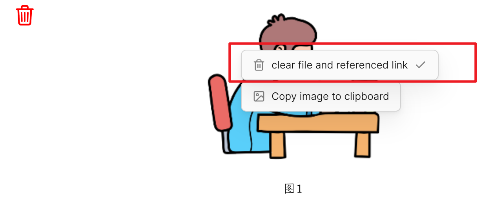

# Fast Image Cleaner

中文 /  [EN](./README.md)

这个插件可以让你快速删除文档中的图片附件和引用链接。你可以通过点击一个按钮或右键菜单快速删除图像（或文件、媒体）附件及其参考链接，以适应不同的情况

## 演示

https://www.bilibili.com/video/BV1U8411T7VH/?share_source=copy_web&vd_source=ddac77d9485ee57e18bdf1b8e1b7c728

## 特性

1. 删除图片附件文件及其引用链接
2. 当同一个图片被引用多次（包含下面给出的两种情况），则会弹出提示窗口，不会直接删除，避免图片被错误删除。弹出窗口有当前引用图片的文档和其他文档引用该图片的文档路径信息，下方有 `close` 按钮和 `remove link` 按钮，点击 `remove link` 按钮可以继续移除**当前文档**中的图片引用链接。
   - 情况1：在用一个文档引用同一个多次
   - 情况2：在多个文档同时引用同一个图片
3. 支持 markdown 和 wiki 链接风格的链接
4. 支持 三种不同格式的**内部链接类型** （[详情](https://help.obsidian.md/Linking+notes+and+files/Internal+links)）
5. - 尽可能简短的形式
   - 基于当前笔记的相对路径
   - 基于仓库根目录的绝对路径
6. 支持的图片类型：`jpg, jpeg, png, gif, svg, bmp`
7. 支持设置图片删除后处理方式：① 移动到系统回收站 ； ②  移动到 obsidian trash ; ③ 永久删除
8. 支持更多文件类型，除了支持 img类型的附件，更多类型附件文件
   1. img类型: img、gif、png、jpeg、svg, bmp
   2.  file类型: docx、pptx、html、epub...
   3. video: mp4、mkv...

9. 支持两种删除模式：①鼠标移入图片点击删除按钮；②鼠标右键点击删除菜单选项

> 😅一点小问题：如果图片在callout块中，可能不会直接显示删除按钮。如果要显示，可以手动在文档其它位置 按一下键盘上的 `blank space` 按键。

## 安装

### 从插件市场安装

直接从插件市场安装

...

### 从 brat安装

👦 添加 `martinniee/Obsidian-fast-image-cleaner` 到 BRAT

### 手动安装

✋ 下载最新版本。将三个文件（main.js、manifest.json、style.css）提取并放到{{obsidian_vault}}/.obsidian/plugins/Obsidian-fast-image-cleaner文件夹中。

## 使用

1. 安装并启用插件
2. 在 **实时阅览**模式下 鼠标移入到图片上方，应该会看到删除按钮，点击删除按钮即可删除图片文件同时从文档中移除引用链接

### 删除目的设置

请确保你在 "通过上下文菜单设置删除图片 "选项卡下选择了被删除图片的目的地。你有3个选项。

1. **移动到黑曜石垃圾桶** - 文件将被移动到黑曜石保险库下的`.trash`。
2. **移动到系统垃圾箱** - 文件将被移动到操作系统垃圾箱。
3. **永久删除** - 文件将被永久销毁。你将不能再恢复了

### 删除方式

方式1：鼠标移入图片，点击删除按钮删除。这种方式仅支持 实时预览模式。

(1)实时预览模式下

方式2：鼠标在图片上右键，点击菜单项删除。这种方式 阅读 和 实时预览模式都支持。

(1)实时预览模式下

（2)阅读模式下

## 开发

这个插件遵循  [Obsidian Sample Plugin](https://github.com/obsidianmd/obsidian-sample-plugin) 插件的结构，请看那里的进一步细节。

## 给我充电

❤ 如果你喜欢使用Obsidian-Fast-Image-Cleaner，那么请支持我的工作，请给我充电。

- 国内捐赠： https://afdian.net/a/nathanel

